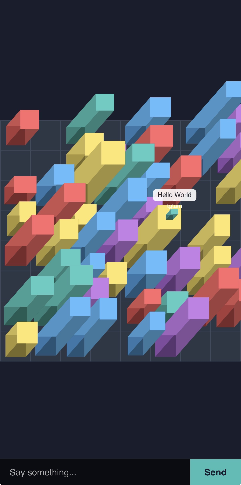
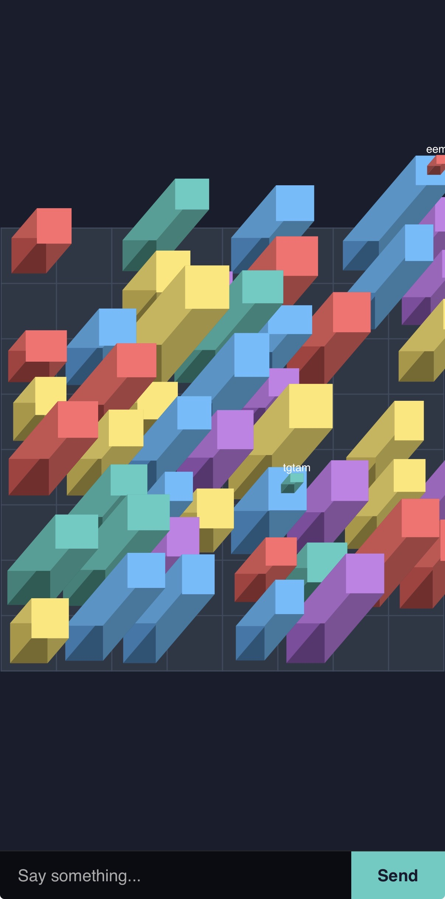

# Simple City Chatroom

A multiplayer isometric city chatroom built with p5.js and Socket.IO. Players appear on top of randomly generated buildings, players can move to different buildings and chat with each other in real time.

## Demo




## How to Run

### Install & Start

```bash
npm install
node server.js
```

The server will start at **https://localhost:3000**. Open it in multiple browser tabs to see multiplayer in action.

### Controls

- Swipe to move between buildings
- Type a message and hit Send

